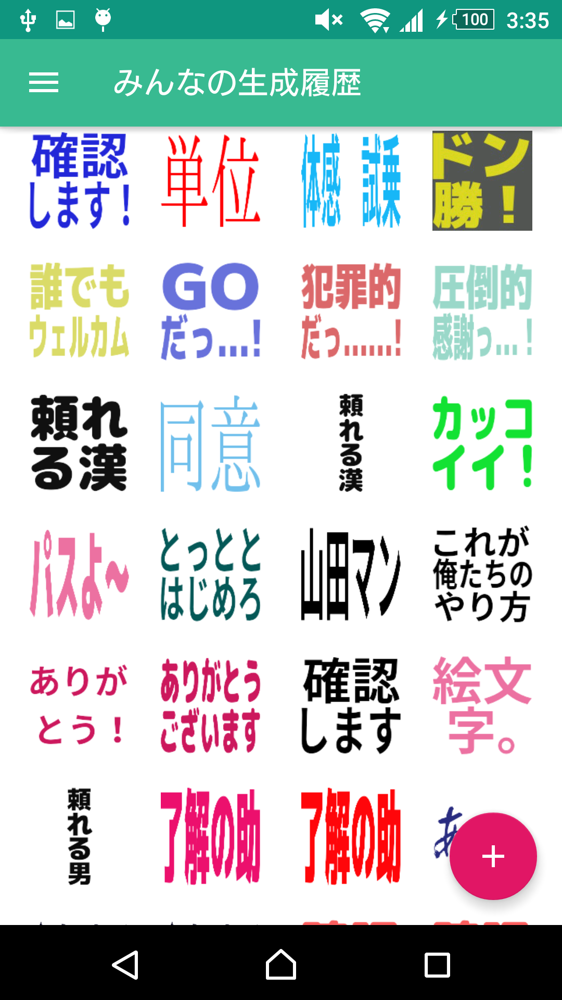
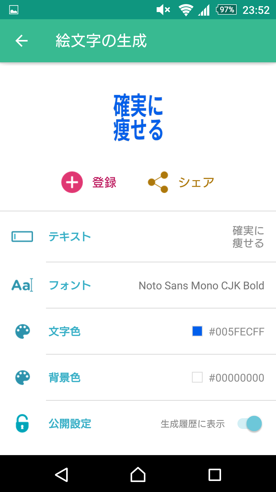
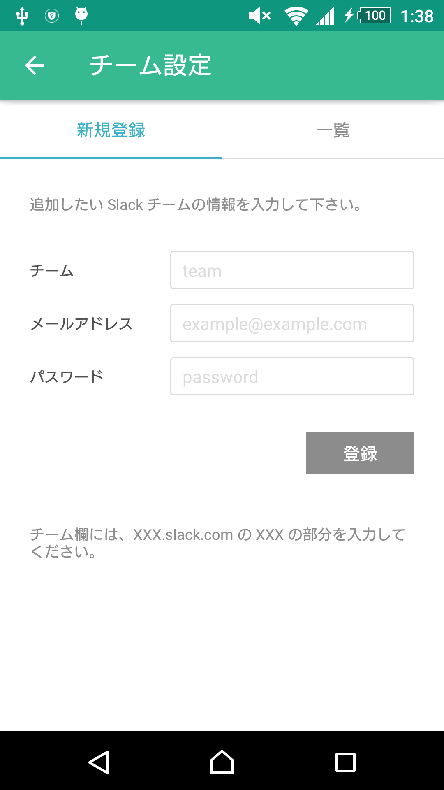

## Emoji-Android &nbsp;[](https://circleci.com/gh/emoji-gen/Emoji-Android/tree/master) [](https://codebeat.co/projects/github-com-emoji-gen-emoji-android-master)

:tada: Ultimate Android Application

  

## Requirements

- Android SDK
- Java 1.8

## Getting Started

```
$ ./gradlew clean :app:installDebug
```

## Release Build

```
$ ./gradlew clean :app:assembleRelease
```

## License
MIT &copy; [Emoji Generator](https://emoji.pine.moe/)
